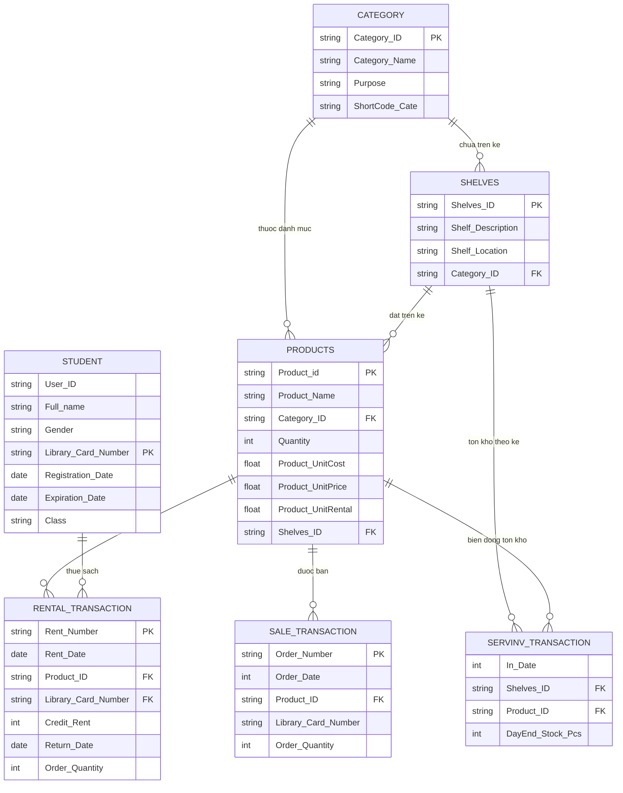

# 📚 Library Analytics Project

Dự án phân tích hoạt động vận hành **thư viện trường học** dựa trên dữ liệu thực tế — doanh thu cho thuê sách, bán sách, biến động tồn kho kệ sách, và hành vi mượn sách của sinh viên.

---

## 🗂️ Cấu trúc Repository

```
library-analytics/
├── README.md
├── Library_Master_TSQL.sql   
└── data/
    ├── Student.csv              (1,017 rows)
    ├── Teacher.csv              (99 rows)
    ├── Category.csv             (12 rows)
    ├── Shelves.csv              (21 rows)
    ├── Products.csv             (50 rows)
    ├── Rental_Transaction.csv   (999 rows)
    ├── Sale_Transaction.csv     (999 rows)
    ├── SerInv_Transaction_.csv  (999 rows)
    ├── Classes.csv              (48 rows)
    ├── RoleId.csv               (5 rows)
    └── Service.csv              (3 rows)
```

---

## 🧰 Tech Stack

| Layer | Công cụ |
|-------|---------|
| Database Engine | SQL Server (T-SQL) |
| BI / Visualization | Power BI Desktop |
| Version Control | Git / GitHub |

---

## 🗄️ Schema & Quan hệ bảng

### Sơ đồ ERD



### Mô tả từng bảng

| Bảng | Rows | Mô tả |
|------|------|-------|
| `Student` | 1,017 | Sinh viên — thẻ thư viện STC01→STC1017 |
| `Teacher` | 99 | Giảng viên — thẻ TC01→TC99 |
| `Category` | 12 | 12 thể loại sách (Business, IT, Science...) |
| `Shelves` | 21 | 21 kệ sách, mỗi kệ thuộc 1 Category |
| `Products` | 50 | 50 đầu sách — có UnitCost, UnitPrice, UnitRental |
| `Rental_Transaction` | 999 | Lịch sử cho thuê (2017–2026) |
| `Sale_Transaction` | 999 | Lịch sử bán sách — ngày lưu dạng Excel serial |
| `SerInv_Transaction` | 999 | Biến động tồn kho cuối ngày — ngày Excel serial |
| `Classes` | 48 | Lớp học — liên kết với Student qua `Class` |
| `RoleId` | 5 | Cấp độ vai trò người dùng |
| `Service` | 3 | Loại dịch vụ (Cho thuê, Bán, Lưu trữ) |

---

## 🎯 Business Questions

| # | Câu hỏi | Kỹ thuật SQL | 
|---|---------|-------------|
| BQ1 | Doanh thu cho thuê theo tháng × danh mục | `CREATE VIEW` + `FORMAT()` + JOIN 3 bảng | 
| BQ2 | Doanh thu bán sách theo tháng × danh mục | Excel serial date conversion | 
| BQ3 | Top 2 danh mục thuê nhiều nhất từng tháng | `ROW_NUMBER() OVER (PARTITION BY)` | 
| BQ4 | Sách có >5 người thuê riêng biệt/tháng | Subquery trong `FROM` | 
| BQ5 | Sách có >5 người thuê riêng biệt/tháng | CTE (`WITH ... AS`) | 
| BQ6 | Sinh viên thuê sách hơn 10 lần | CTE + `JOIN Student` |
| BQ7 | Tồn kho trung bình theo kệ sách × danh mục | `AVG / MIN / MAX` + JOIN | 
| BQ8 | So sánh doanh thu Thuê vs Bán theo năm | Multi-CTE + `FULL OUTER JOIN` |

---

## 🔑 Kỹ thuật SQL sử dụng

| Kỹ thuật | BQ |
|----------|-----|
| `CREATE VIEW` | BQ1 |
| `FORMAT()` phân nhóm tháng | BQ1, BQ2, BQ4, BQ5 |
| Excel serial date conversion (`DATEADD`) | BQ2, BQ8 |
| `ROW_NUMBER() OVER (PARTITION BY)` | BQ3 |
| Subquery trong `FROM` | BQ4 |
| CTE — `WITH ... AS (...)` | BQ5, BQ6 |
| Multi-CTE + `FULL OUTER JOIN` | BQ8 |
| `COUNT(DISTINCT ...)` | BQ4, BQ5 |
| `AVG / MIN / MAX` | BQ7 |
| `COALESCE / ISNULL` | BQ8 |

---

## 🚀 Cách chạy

SSMS (SQL Server Management Studio)

### Bước 1 — Tạo Database
```sql
CREATE DATABASE LibraryDB;
```

### Bước 2 — Import CSV vào SQL Server
Trong SSMS → Right-click `LibraryDB` → **Tasks → Import Flat File**  
Import lần lượt từng file CSV trong thư mục `data/`.

> Tên table sau khi import phải khớp chính xác:
> `Student`, `Teacher`, `Category`, `Shelves`, `Products`,
> `Rental_Transaction`, `Sale_Transaction`, `SerInv_Transaction`,
> `Classes`, `RoleId`, `Service`

### Bước 3 — Chạy Query
1. Mở `Library_Master_TSQL.sql` trong SSMS
2. Đảm bảo đang ở đúng database: `USE LibraryDB`
3. Chạy **PHẦN 2 trước** (tạo View `v_DoanhThuThueThang`) — BQ3 phụ thuộc view này
4. Chạy từng PHẦN tiếp theo

---

## 📈 Insight dự kiến

- **Doanh thu:** So sánh Thuê vs Bán cho thấy kênh nào đóng góp nhiều hơn theo từng năm
- **Sách hot:** Các đầu sách có >5 người thuê/tháng là ứng viên cần bổ sung tồn kho
- **Kệ sách:** Kệ có `TonKhoBinhQuan` thấp nhất = ưu tiên nhập hàng trước
- **Sinh viên tích cực:** Nhóm thuê >10 lần là đối tượng cho chương trình thẻ thư viện ưu đãi


## 📈 Key Findings (từ dữ liệu thực tế)

> Tính trực tiếp từ 999 giao dịch thuê sách 2017–2026.

- 📚 **Top 3 thể loại thuê nhiều nhất:** Tài liệu nghiên cứu IT Infras (1,899 cuốn), Bộ đề tự luyện IT Data Science (1,559), Sách dạy học IT Data Science (1,539) — nhu cầu học IT chiếm ưu thế rõ rệt
- 💰 **Tổng doanh thu cho thuê 2017–2026: ~376.8 triệu VND** — trung bình ~37.7 triệu/năm
- 📊 **Nhu cầu thuê ổn định:** dao động 1,000–1,200 cuốn/năm, không có xu hướng tăng đột biến → cần chiến dịch kích cầu
- 👥 **Chỉ 91/1,017 sinh viên (9%) có giao dịch thuê sách** — 91% sinh viên chưa sử dụng dịch vụ → tiềm năng mở rộng tệp người dùng rất lớn
- 🎯 **Đề xuất:** Ưu tiên bổ sung tồn kho các đầu sách IT; chạy chương trình khuyến khích sinh viên năm 1–2 đăng ký thẻ thư viện

---

## 👤 Tác giả

**NGUYEN HUNG THANH** — Data Analyst


hungthsnhnguyen37@gmail.com
